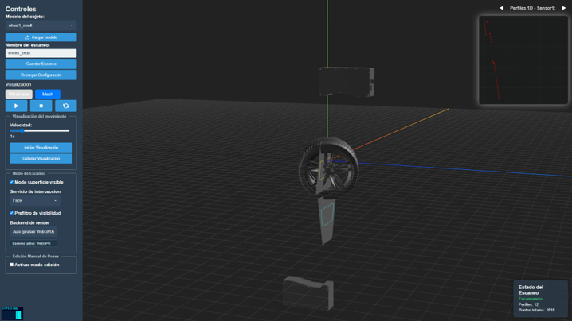

# 3D Scanner Simulator

Simulador web de **perfilómetros láser** para modelos 3D (digitalización, modelos 3D, piezas industriales...). Emula el proceso real de adquisición 3D: plano láser, ROI, perfiles discretos, oclusiones, movimientos de objeto/sensor y reconstrucción con transformaciones inversas.



Stack: **Three.js** (WebGL/WebGPU), **Vite**, **Express**, **YAML** declarativo.

---

## Tabla de contenidos

- [Por qué no basta con convertir una malla](#por-qué-no-basta-con-convertir-una-malla)
- [Inicio rápido](#inicio-rápido)
- [Cómo funciona la simulación](#cómo-funciona-la-simulación)
- [Arquitectura](#arquitectura)
- [Configuración YAML](#configuración-yaml)
- [Intersección y visibilidad](#intersección-y-visibilidad)
- [Interfaz y flujo de trabajo](#interfaz-y-flujo-de-trabajo)
- [Exportación y reconstrucción 3D](#exportación-y-reconstrucción-3d)
- [Galería](#galería)
- [Docker](#docker)
- [Desarrollo local](#desarrollo-local)
- [Servir desde Windows / WSL](#servir-desde-windows--wsl)
- [Documentación adicional](#documentación-adicional)

---

## Por qué no basta con convertir una malla

| Aspecto | Conversión trivial de malla | Este simulador |
|--------|-----------------------------|----------------|
| Adquisición | Puntos directos de la geometría | Emulación del perfilómetro (perfil a perfil) |
| Oclusión | No modelada | Superficie visible vs. geometría completa |
| Celda de escaneo | No configurable | Sensores, poses, ROI, movimientos |
| Salida | Nube genérica | Perfiles y reconstrucción orientados a inspección industrial |

**Capacidades principales:**

- Múltiples sensores con pose, ROI y movimientos propios
- Movimientos de objeto y sensor: rotación/traslación en X, Y, Z; simultáneos o secuenciales
- Transformaciones inversas para reconstrucción 3D en espacio real
- Mallas sin modificar: se colocan en escena tal cual
- Validación automática de configuración YAML
- Exportación combinada y por sensor (CSV, TXT, RAW, ZIP con reconstrucción)

---

## Inicio rápido

```bash
./init.sh
```

Abre **http://localhost:8123**.

`init.sh` construye la imagen, libera el puerto 8123 si hace falta, arranca el contenedor y monta volúmenes para `public/configs` (lectura/escritura) y `public/models` (solo lectura), de modo que cambios en YAML y modelos se reflejan sin reconstruir la imagen.

Configuración de ejemplo:

```bash
cp public/configs/simulator.example.yaml public/configs/simulator.yaml
```

---

## Cómo funciona la simulación

### Flujo de escaneo

1. Se cargan sensores y objeto desde `simulator.yaml`.
2. Para cada perfil `i`:
   - Se calcula la pose del objeto según sus movimientos.
   - Para cada sensor:
     - Se calcula la pose del sensor según sus movimientos.
     - Se intersecta el plano láser (ROI trapezoidal) con la malla.
     - Se almacenan los puntos del perfil (por sensor).
3. Al finalizar, se restauran las poses iniciales.

### Reconstrucción 3D

Para cada perfil capturado se conoce la pose del objeto en ese instante. La exportación aplica la **transformación inversa** a cada punto y obtiene su posición en el espacio 3D real.

Detalle matemático completo: [assets/RECONSTRUCCION_3D.md](./assets/RECONSTRUCCION_3D.md).

### Modos de detección

- **Superficie visible** (por defecto): filtra por distancia al sensor en cada sector del perfil; solo queda el punto más cercano (oclusión y caras internas descartadas de forma eficiente).
- **Rayos X**: todas las intersecciones con la geometría, útil para depuración.

> En geometrías muy cóncavas pueden quedar residuos puntuales, análogo al ruido impulsional de sensores reales.

---

## Arquitectura

Patrón **MVVM** con separación clara de responsabilidades.

```
UI (index.html)
  → SimulationViewModel
      → Model: Sensor, PointCloud
      → Services: intersección, transformaciones, carga, exportación, validación
  → ThreeView (solo render 3D)
```

| Capa | Módulos |
|------|---------|
| **Model** | `Sensor.js`, `PointCloud.js` |
| **ViewModel** | `SimulationViewModel.js`, commands (`Start` / `Stop` / `Reset`) |
| **View** | `ThreeView.js` |
| **Services** | `EdgePlaneIntersectionService`, `FacePlaneIntersectionService`, `RaycastingIntersectionService`, `TransformationService`, `ScanExportService`, `ModelLoader`, `ConfigValidationService`, `ProfileRenderer2D` |

**Flujo:** controles UI → comandos ViewModel → modelos/servicios → notificación a `ThreeView` → actualización de escena y canvas 2D de perfiles.

Las mallas cargan un **BVH** (`three-mesh-bvh`) para acelerar raycasts de oclusión.

---

## Configuración YAML

Archivo activo: `public/configs/simulator.yaml`.  
Referencia comentada: `public/configs/simulator.example.yaml`.

### Estructura

| Sección | Contenido |
|---------|-----------|
| `scene`, `camera`, `lights` | Escena Three.js |
| `models.object` | Ruta del objeto a escanear |
| `sensors[]` | `id`, `model`, `pointsPerProfile`, `pose`, `roi`, `movements` |
| `object` | `initialPose`, `movements` |
| `simulation` | `intersectionMethod`, `defaultProfiles`, `offsetZ`, `rendererBackend`, etc. |

### Ejemplo mínimo

```yaml
sensors:
  - id: 'sensor_1'
    model: '/models/gocator.glb'
    pointsPerProfile: 1024
    pose:
      position: [0, 0, 0]
      rotation: [0, 0, 0]
    roi:
      yMax: 0.05
      yMin: -0.025
      x0: -0.15
      x1: -0.135
      x2: 0.135
      x3: 0.15
    movements:
      - type: 'rotation'
        axis: 'z'
        value: 90
        duration: 1000
        startProfile: 0

object:
  initialPose:
    position: [0, -0.25, 0]
    rotation: [0, 0, 0]
  movements:
    - type: 'rotation'
      axis: 'x'
      value: 360
      duration: 4096
      startProfile: 0
```

### Validación

`ConfigValidationService` comprueba campos obligatorios, tipos, ROI trapezoidal válido y parámetros de movimientos. Errores y advertencias en consola del navegador.

---

## Intersección y visibilidad

Selector en la GUI (persistido en YAML como `simulation.intersectionMethod`):

| Método | Descripción |
|--------|-------------|
| **Edge** | Plano-aristas. Rápido, aproximado. |
| **Face** | Plano-caras con muestreo denso. Más detalle. |
| **Raycasting** | Rayo por muestra del perfil. Mejor para oclusión/superficie visible. |

**Prefiltro de visibilidad** (`visibilityPrefilterEnabled`): en Edge/Face descarta candidatos traseros antes del raycast de oclusión.

**Backend de render:** Auto (preferir WebGPU), WebGL o WebGPU. Si WebGPU no está disponible, fallback automático a WebGL.


---

## Interfaz y flujo de trabajo

### Escaneo

1. Elegir o cargar modelo (GLB, GLTF, OBJ, STL, PLY).
2. Ajustar parámetros en YAML o con **Recargar Configuración**.
3. Iniciar / detener / reiniciar escaneo.
4. Ver perfiles 1D por sensor (navegación ◀ ▶).
5. **Guardar Escaneo** → ZIP con exportaciones.

### Visualización de movimiento (sin escanear)

- Velocidad 0.1x–5x, loop continuo.
- ROI y sensores se actualizan con el movimiento.

### Edición manual de poses

- Modo edición con gizmos (traslación / rotación / escala).
- Selector objeto o sensor.
- **Guardar Pose Inicial** → escribe en `simulator.yaml` (solo pose inicial, no movimientos).

### Visualización 3D

- Wireframe o mesh (solo afecta al render, no a la intersección).

---

## Exportación y reconstrucción 3D

`ScanExportService` genera un ZIP con:

| Archivo | Contenido |
|---------|-----------|
| `*_raw.txt` | Perfiles en binario float32 (X, Y, Z local) |
| `*_data.csv` | Coordenadas desenrolladas con offset Z por perfil |
| `*_xyz.txt` | Mismo contenido en texto |
| `*_reconstructed.ply` | Nube 3D con transformaciones inversas |
| `*_<sensorId>_*.csv/txt` | Perfiles individuales si hay varios sensores |

Script auxiliar post-proceso: `scripts/reunravell.py` (reajuste de incrementos Z en TXT exportados).

---

## Galería

|  |  |
|---------------------|-------------------|
|  |  |
|  |  |
|  |  |
|  | |
|  |  |

---

## Docker

Imagen multi-stage (`Dockerfile`): **builder** (Vite `npm run build`) + **runner** (Node Alpine + `scripts/server.js` en puerto **8123**).

### Recomendado

```bash
./init.sh
```

### Manual

```bash
docker build -f Dockerfile -t 3d-scanner-simulator-image .
docker run -d --name 3d-scanner-simulator-container -p 8123:8123 \
  -v "$(pwd)/public/configs:/app/public/configs:rw" \
  -v "$(pwd)/public/models:/app/public/models:ro" \
  3d-scanner-simulator-image
```

Detener y eliminar:

```bash
./stop.sh
# o
docker stop 3d-scanner-simulator-container && docker rm 3d-scanner-simulator-container
```

Alternativa rápida (sin volúmenes): `./start.sh`.

**Requisitos Docker** ([instalación](https://docs.docker.com/engine/install/ubuntu/)):

```bash
sudo groupadd docker && sudo usermod -aG docker $USER && sudo systemctl restart docker
```

`.dockerignore` excluye artefactos innecesarios del contexto de build.

### API del servidor (`scripts/server.js`)

| Endpoint | Función |
|----------|---------|
| `GET /healthcheck` | Estado del servicio |
| `GET /configs/*` | YAML sin caché |
| `GET /api/models` | Lista de modelos en `public/models` |
| `POST /api/save-config` | Guardar `simulator.yaml` |

---

## Desarrollo local

**Requisitos:** Node.js 18+, npm.

```bash
npm install
npm run dev      # http://localhost:8123 (Vite, HMR)
npm run build    # producción → dist/
npm run preview  # previsualizar build
```

- HMR en HTML, CSS y JS.
- `public/configs/` y `public/models/` se leen del disco; cambios en YAML con **Recargar Configuración** o recarga de página.
- En desarrollo, Vite expone los mismos endpoints de modelos y guardado de config que el servidor de producción.

---

## Servir desde Windows / WSL

Alternativa histórica sin Docker: servir desde WSL y exponer el puerto en la LAN de Windows.

### Redirección de puerto WSL → Windows

Desde **CMD como administrador** ([referencia](https://stackoverflow.com/questions/75299266/how-can-i-expose-my-vite-project-in-wsl2ubuntu)):

```cmd
netsh interface portproxy add v4tov4 listenaddress=172.16.102.205 listenport=8123 connectaddress=172.20.209.226 connectport=8123
netsh interface portproxy show all
netsh interface portproxy delete v4tov4 listenaddress=172.16.102.205 listenport=8123
```

Tipo de red actual:

```powershell
Get-NetConnectionProfile
```

### Firewall de Windows

Permitir puerto 8123 solo en red de dominio:

```powershell
New-NetFirewallRule -DisplayName "Vite 8123 Domain" -Direction Inbound -LocalPort 8123 -Protocol TCP -Action Allow -Profile Domain
New-NetFirewallRule -DisplayName "Block Vite 8123 on Public and Private" -Direction Inbound -LocalPort 8123 -Protocol TCP -Action Block -Profile Public,Private
Start-Service iphlpsvc
Remove-NetFirewallRule -DisplayName "Vite 8123" -ErrorAction SilentlyContinue
Get-NetFirewallRule | Where-Object { $_.DisplayName -like "*8123*" } | Format-Table DisplayName, Enabled, Direction, Action
```

### Troubleshooting opcional

**`.wslconfig`** con networking mirrored ([referencia](https://www.reddit.com/r/wsl2/comments/1ercy2f/how_to_run_vite_react_dev_server_from_wsl2ubuntu/)):

```ini
[network]
networkingMode=mirrored
```

**UFW en WSL:**

```bash
sudo apt install ufw
sudo ufw allow 8123
```

**Vite accesible en red:**

```bash
npm run dev -- --host
```

**Regla permisiva (no recomendada):**

```powershell
New-NetFirewallRule -DisplayName "Allow All Vite 8123" -Direction Inbound -LocalPort 8123 -Protocol TCP -Action Allow -Profile Any
Remove-NetFirewallRule -DisplayName "Allow All Vite 8123"
```

---

## Documentación adicional

- [Reconstrucción 3D: teoría y matemáticas](./assets/RECONSTRUCCION_3D.md)
- [TODO / roadmap](./TODO.md) (e.g. paralelización con Web Workers)

---

## Estado de implementación

- Múltiples sensores, ROI y movimientos complejos
- Transformaciones inversas y exportación por sensor
- Validación YAML, visualización en tiempo real, edición manual de poses
- Tres servicios de intersección + prefiltro de visibilidad
- Backend WebGPU/WebGL, carga de modelos y API REST de configuración
