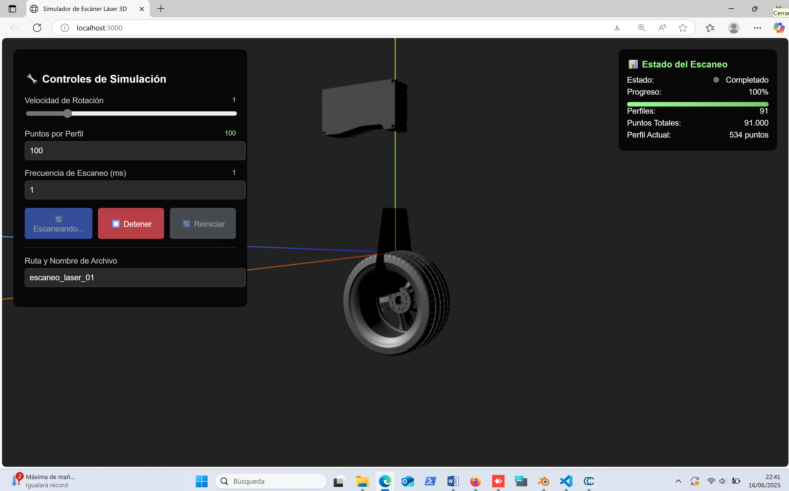
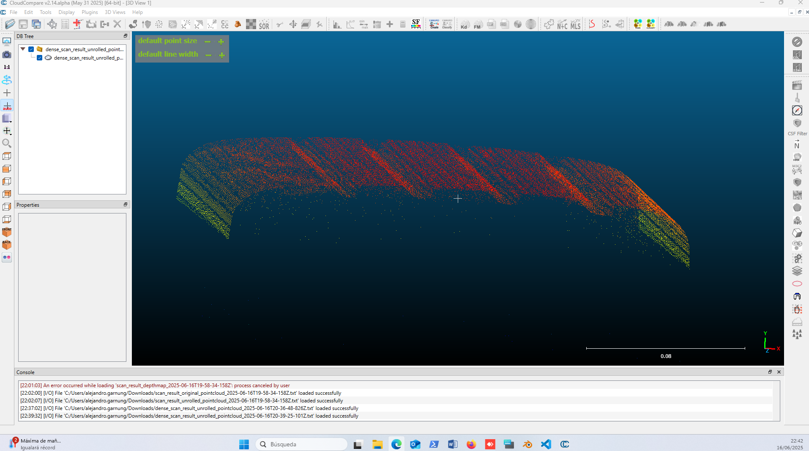
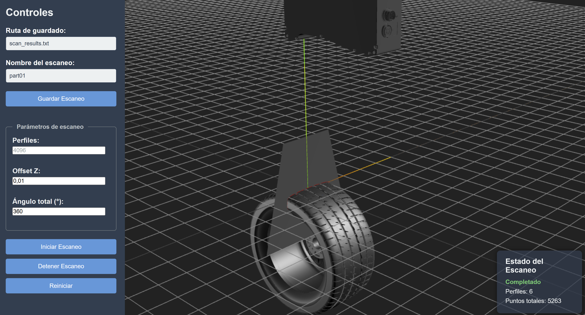
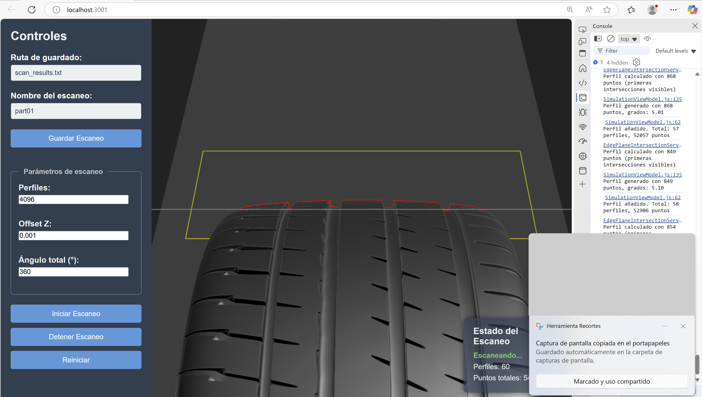
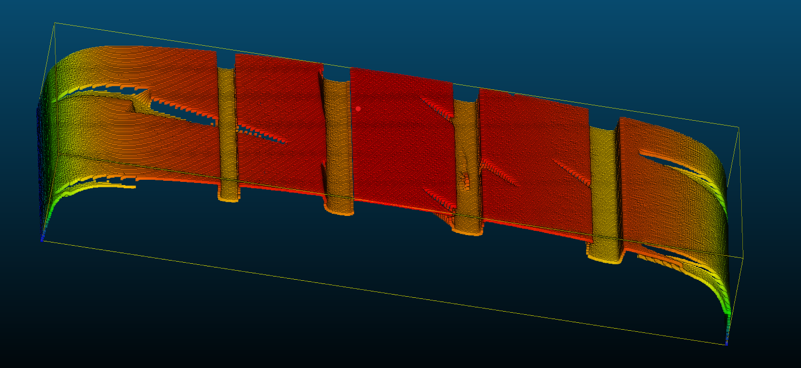
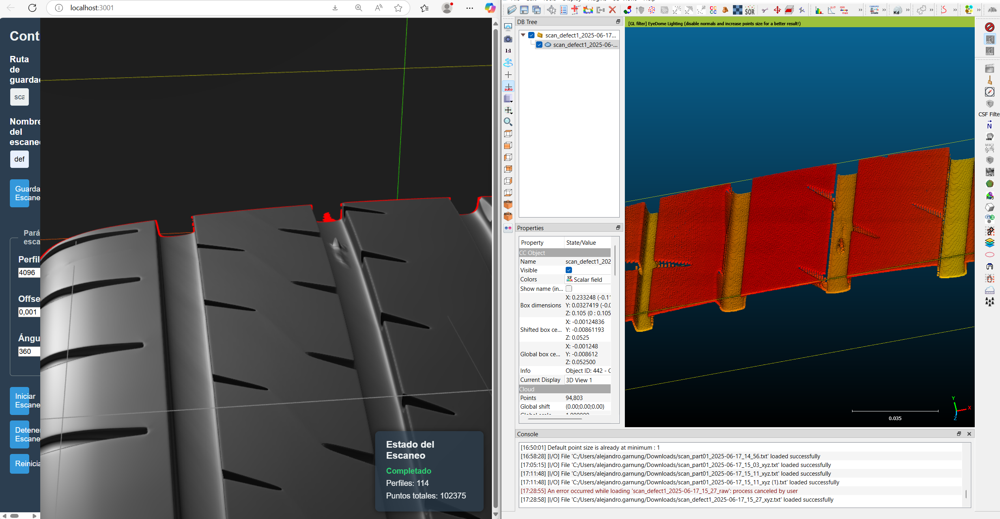
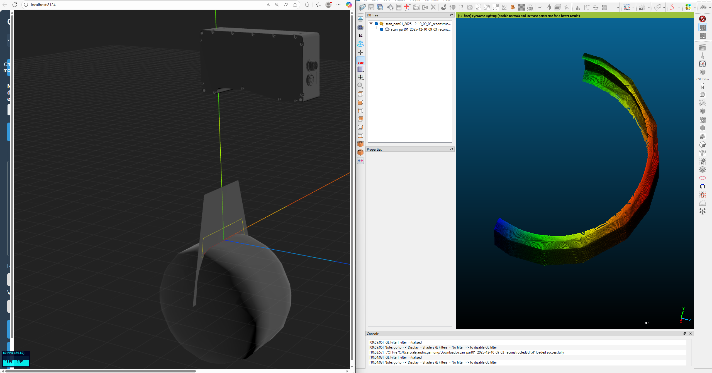
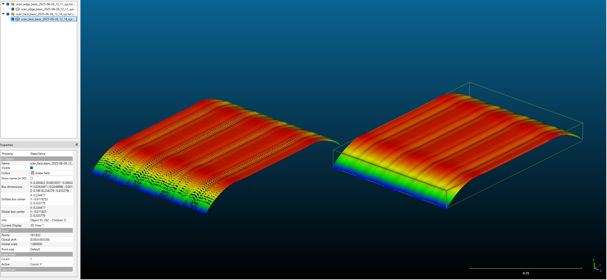

# 3d-scanner-simulator

A 3D scanning simulator focused on scanning industrial parts with laser profilometers.

Es un simulador de perfilómetros láser.

## 🚀 Generalización del Simulador (Fork)

Este proyecto ha sido generalizado para soportar configuraciones avanzadas de escaneo 3D:

### Características Principales

- **Múltiples Sensores**: Soporta cualquier número de sensores configurados simultáneamente
- **Poses Configurables**: Cada sensor puede tener su propia posición y orientación inicial
- **ROI Personalizado**: Cada sensor puede tener su propia región de interés (ROI) configurable
- **Movimientos Complejos**: 
  - Rotaciones y traslaciones en cualquier eje (X, Y, Z)
  - Movimientos simultáneos o secuenciales
  - Aplicables tanto a objetos como a sensores
- **Transformaciones Inversas**: Sistema de reconstrucción que aplica transformaciones inversas para obtener la posición real de los puntos escaneados
- **Mallas Sin Modificar**: Las mallas se colocan en escena tal como son, sin modificaciones

### Plan de Implementación

#### 1. Configuración YAML (`public/configs/simulator.yaml`)

La configuración ahora soporta:
- **Múltiples sensores** con poses y ROI individuales
- **Movimientos de objetos** (rotaciones/traslaciones en cualquier eje)
- **Movimientos de sensores** (rotaciones/traslaciones en cualquier eje)

Ejemplo de configuración:
```yaml
sensors:
  - id: 'sensor_1'
    model: '/models/gocator.glb'
    pointsPerProfile: 1024
    pose:
      position: [0, 0, 0]
      rotation: [0, 0, 0]
    roi:
      yMax: 0.05
      yMin: -0.025
      x0: -0.15
      x1: -0.135
      x2: 0.135
      x3: 0.15
    movements:
      - type: 'rotation'
        axis: 'z'
        value: 90
        duration: 1000
        startProfile: 0

object:
  initialPose:
    position: [0, -0.25, 0]
    rotation: [0, 0, 0]
  movements:
    - type: 'rotation'
      axis: 'x'
      value: 360
      duration: 4096
      startProfile: 0
```

#### 2. Arquitectura Generalizada

- **Sensor.js**: Clase generalizada que soporta pose, ROI y movimientos
- **TransformationService.js**: Servicio para calcular transformaciones y sus inversas
- **Servicios de Intersección**: Actualizados para trabajar con poses de sensores
- **SimulationViewModel**: Maneja múltiples sensores y aplica transformaciones

#### 3. Flujo de Escaneo

1. Se cargan los sensores y el objeto desde la configuración
2. Para cada perfil:
   - Se calcula la pose del objeto basada en sus movimientos
   - Se aplica la pose al objeto
   - Para cada sensor:
     - Se calcula la pose del sensor basada en sus movimientos
     - Se aplica la pose al sensor
     - Se realiza el escaneo con el plano láser del sensor
     - Se almacenan los perfiles por sensor
3. Al finalizar, se restauran las poses iniciales

#### 4. Reconstrucción 3D

El sistema de exportación aplica transformaciones inversas:
- Para cada perfil, se calcula la pose que tenía el objeto cuando se capturó
- Se aplica la transformación inversa a cada punto
- Se obtiene la posición real del punto en el espacio 3D

Consúltese el documento [RECONSTRUCCIÓN_3D](./assets/RECONSTRUCCION_3D.md) para una explicación detallada del proceso de escaneado y reconstrucción seguido.

#### 5. Configuración de Ejemplo

Se ha creado un archivo de configuración de ejemplo completo en `public/configs/simulator.example.yaml` que muestra:
- Configuración de múltiples sensores con diferentes poses y ROI
- Ejemplos de movimientos complejos (rotaciones y traslaciones)
- Movimientos simultáneos y secuenciales
- Comentarios detallados explicando cada opción

Para usar el ejemplo, copia el archivo:
```bash
cp public/configs/simulator.example.yaml public/configs/simulator.yaml
```

Luego edita `simulator.yaml` según tus necesidades.

#### 6. Validación de Configuración

El sistema ahora incluye validación automática de configuraciones:
- Valida que todos los campos requeridos estén presentes
- Verifica tipos de datos y rangos válidos
- Comprueba que los ROI formen trapecios válidos
- Valida movimientos y sus parámetros
- Muestra errores y advertencias en la consola

#### 7. Exportación Mejorada

El sistema de exportación ahora:
- Exporta perfiles combinados de todos los sensores
- Exporta perfiles individuales por sensor (cuando hay múltiples sensores)
- Incluye metadatos en los archivos CSV (ID del sensor, número de perfiles, etc.)
- Aplica transformaciones inversas correctamente para la reconstrucción 3D

#### 8. Visualización en Tiempo Real

El simulador ahora incluye un modo de visualización en tiempo real que muestra los movimientos configurados sin realizar el escaneo completo:

- **Iniciar/Detener Visualización**: Botones en la interfaz para controlar la visualización
- **Control de Velocidad**: Slider para ajustar la velocidad de reproducción (0.1x a 5x)
- **Movimientos Suaves**: Los objetos y sensores se mueven suavemente según sus configuraciones
- **ROI Dinámico**: Las visualizaciones de ROI se actualizan cuando los sensores se mueven
- **Loop Continuo**: La visualización se repite automáticamente al llegar al final

**Uso:**
1. Carga el objeto y los sensores
2. Configura los movimientos en el archivo YAML
3. Haz clic en "Iniciar Visualización" para ver los movimientos en tiempo real
4. Ajusta la velocidad con el slider si es necesario
5. Haz clic en "Detener Visualización" para detener y restaurar las poses iniciales

#### 9. Edición Manual de Poses

El simulador incluye un modo de edición manual que permite ajustar visualmente las poses iniciales de objetos y sensores:

- **Modo Edición**: Activa/desactiva los controles de transformación tipo Blender (ejes rojo, verde, azul)
- **Selección de Objetos**: Permite elegir entre el objeto principal o cualquier sensor configurado
- **Controles Visuales**: Mueve y rota objetos usando los controles interactivos en la escena 3D
- **Guardar Pose Inicial**: Guarda automáticamente las nuevas poses en el archivo `simulator.yaml`
- **Solo Pose Inicial**: Solo se actualiza la pose inicial, no los movimientos configurados

**Uso:**
1. Activa el checkbox "Activar modo edición" en la interfaz
2. Selecciona el objeto o sensor que deseas mover desde el selector
3. Usa los controles visuales (flechas para traslación, anillos para rotación) para ajustar la posición
4. Haz clic en "Guardar Pose Inicial" para guardar los cambios en el YAML
5. Desactiva el modo edición para ocultar los controles

#### 10. Características Implementadas

✅ Múltiples sensores con poses y ROI configurables  
✅ Movimientos complejos (rotaciones y traslaciones en cualquier eje)  
✅ Transformaciones inversas para reconstrucción 3D  
✅ Validación de configuraciones  
✅ Exportación por sensor  
✅ Visualización de múltiples sensores y sus ROI  
✅ Visualización en tiempo real de movimientos  
✅ Edición manual de poses iniciales con controles visuales

## Galería

<table style="margin: 0 auto; border-collapse: collapse;">
  <tr>
    <td style="text-align: center; padding: 10px;">
      
    </td>
  </tr>
  <tr>
    <td style="text-align: center; padding: 10px;">
      
    </td>
  </tr>
  <tr>
    <td style="text-align: center; padding: 10px;">
      
    </td>
  </tr>
  <tr>
    <td style="text-align: center; padding: 10px;">
      
    </td>
  </tr>
  <tr>
    <td style="text-align: center; padding: 10px;">
      
    </td>
  </tr>
  <tr>
    <td style="text-align: center; padding: 10px;">
      
    </td>
  </tr>
  <tr>
    <td style="text-align: center; padding: 10px;">
      
    </td>
  </tr>
</table>

## Descripción

Explicación de la implementación MVVM (adaptada).

### Model (Modelo de Datos)

- **Object3D.js**: Representa el objeto a escanear (rueda) con propiedades de posición, rotación y velocidad
- **Sensor.js**: Representa el sensor láser con posición, orientación y frecuencia de escaneo
- **PointCloud.js**: Almacena los puntos capturados durante el escaneo

### ViewModel (Lógica de Presentación)

- **SimulationViewModel.js**: Coordina la simulación, conecta modelos con servicios
- **Commands**: Patrón Command para acciones (Iniciar/Detener/Reiniciar escaneo)

### View (Presentación)

- **ThreeView.js**: Encargada exclusivamente del renderizado 3D con Three.js
  - No contiene lógica de negocio, solo actualiza la visualización basada en el ViewModel

### Services (Lógica de Negocio)

- **IntersectionService.js**: Calcula la intersección entre el láser y el objeto
- **ModelLoader.js**: Carga diferentes formatos de modelos 3D (OBJ, STL, GLB)

### Flujo de trabajo

1. El usuario interactúa con los controles UI
2. Los controles ejecutan comandos en el ViewModel
3. El ViewModel actualiza los modelos y servicios
4. El ViewModel notifica a la View para actualizar la visualización
5. ThreeView actualiza la escena 3D basada en el estado actual

Esta implementación mantiene una clara separación de responsabilidades siguiendo el patrón MVVM:

- El Modelo solo almacena datos
- El ViewModel contiene la lógica de presentación y coordinación
- La Vista solo se encarga de la representación visual
- Los Servicios encapsulan lógica compleja reusable

### Funcionamiento de la simulación

La simulación básica funciona así:

1. Se carga un modelo 3D (rueda) y un sensor
2. Al iniciar el escaneo, la rueda comienza a rotar
3. Según la frecuencia configurada, se calcula la intersección láser-objeto
4. Los puntos de intersección se añaden a la nube de puntos
5. La nube de puntos se visualiza en tiempo real

El modo `wireframe` solo influye en la visualización; no cambia la geometría ni el comportamiento físico del objeto, es decir, la intersección de plano con las caras debería seguir funcionando igual que en modo `mesh`.

#### Modo de Escaneo: Superficie Visible vs Rayos X

El simulador incluye dos modos de detección de intersecciones:

- **Modo Superficie Visible (por defecto)**: Solo detecta triángulos orientados hacia el sensor, simulando el comportamiento real de sensores láser de triangulación. Este modo filtra automáticamente las caras internas y la cara inferior de objetos, mostrando únicamente la superficie externa visible desde la perspectiva del sensor.

- **Modo Rayos X**: Detecta todas las intersecciones con la geometría, incluyendo caras internas y la cara inferior. Útil para debugging o análisis completo de la geometría.

El modo se puede cambiar mediante el checkbox "Modo superficie visible" en la interfaz de usuario.

**Implementación del Modo Superficie Visible:**

El modo superficie visible utiliza un filtrado eficiente por distancia para garantizar que solo se detecten puntos realmente visibles:

**Filtrado por distancia**: En cada sector del perfil láser, mantiene solo el punto más cercano al sensor. Como los puntos ocluidos están necesariamente más lejos que los puntos visibles, este filtrado elimina automáticamente la oclusión y las caras internas sin necesidad de cálculos costosos de normales o raycasting.

Esta técnica es computacionalmente muy eficiente y asegura que el sensor solo detecte la superficie más externa y visible, sin atravesar el objeto ni detectar puntos ocluidos.

> **Nota**: Aunque el filtrado por distancia elimina la mayoría de puntos no visibles, pueden quedar algunos residuos de puntos que se cuelan como ruido impulsional, especialmente en geometrías complejas o con concavidades profundas. Esto es normal y similar al comportamiento de sensores láser reales.

Detalle sobre la diferencia entre los distintos servicios de intersección (edge [usando solo las aristas de cada triángulo] vs. face [usando toda la superficie de cada triángulo]):

<table style="margin: 0 auto; border-collapse: collapse;">
  <tr>
    <td style="text-align: center; padding: 10px;">
      
    </td>
  </tr>
</table>

## Uso del simulador

### Inicio rápido con script

Para facilitar el inicio del sistema, se ha creado un script `init.sh` que automatiza todo el proceso:

```bash
./init.sh
```

> **Nota**: El script `init.sh` detecta y elimina automáticamente contenedores existentes que puedan estar usando el puerto 8123, evitando conflictos de puertos.

## Docker

Esta app web está contenedorizada con Docker, en el que se lanza. Usamos Docker clásico, sin necesidad de Docker Compose al tener solo una imagen (un servicio). El entorno de desarrollo, despliegue y sus dependencias se instalan dentro del contenedor.

> **Nota**: Primero [instalar Docker](https://docs.docker.com/engine/install/ubuntu/) y agregar nuestro usuario al grupo Docker (luego, reiniciar):

```bash
sudo groupadd docker && sudo usermod -aG docker $USER && sudo systemctl restart docker
```

El despliegue de Docker se hace en dos pasos ([_multi-stage builds_](https://stackoverflow.com/questions/56645546/from-as-in-dockerfile-not-working-as-i-expect)): uno para construirlo (instalación de librerías, dependencias...) y otro para ejecutarlo (servir los archivos de producción de la app web).

Se crea un `.dockerignore` para evitar tener que copiar archivos innecesarios del proyecto.

### Construcción y ejecución

Para construir nuestra imagen, desde `/opt/3d-scanner-simulator` (usando `--no-cache` si se quieren reconstruir todas las etapas):

```bash
docker build -f Dockerfile -t 3d-scanner-simulator-image .
```

Y para iniciar el nuevo contenedor desde la imagen (lo cual levantará la app en http://localhost:8123):

```bash
docker run -d --name 3d-scanner-simulator-container -p 8123:8123 3d-scanner-simulator-image
```

La imagen desde la cual se crea el contenedor es `3d-scanner-simulator-image`. El contenedor ejecutado se llamará `3d-scanner-simulator-container`. El puerto 8123 del contenedor se mapea al puerto 8123 del host (`host:contenedor`). El servicio del contenedor estará disponible en este puerto.

> **Nota**: Para detener y eliminar el contenedor:

```bash
docker stop 3d-scanner-simulator-container && docker rm 3d-scanner-simulator-container
```

## Desarrollo Local

Para desarrollo local con hot reloading (recarga automática al cambiar archivos), se puede ejecutar el simulador directamente sin Docker:

### Requisitos

- Node.js (versión 18 o superior recomendada)
- npm

### Instalación y Ejecución

1. **Instalar dependencias**:
```bash
npm install
```

2. **Iniciar servidor de desarrollo**:
```bash
npm run dev
```

El simulador estará disponible en `http://localhost:5173` (o el puerto que Vite asigne automáticamente).

### Características del Modo Desarrollo

- **Hot Module Replacement (HMR)**: Los cambios en el código se reflejan automáticamente en el navegador sin necesidad de recargar manualmente
- **Recarga automática**: Los cambios en archivos HTML, CSS y JavaScript se aplican instantáneamente
- **Servidor de desarrollo rápido**: Vite proporciona un servidor de desarrollo optimizado con tiempos de compilación muy rápidos

### Notas

- Los archivos de configuración (`public/configs/simulator.yaml`) y modelos (`public/models/`) se leen directamente desde el sistema de archivos local
- Los cambios en la configuración YAML se reflejan al recargar la página o usar el botón "Recargar Configuración"
- Para producción, usar `npm run build` y luego `npm run preview` o desplegar usando Docker

Este script construye la imagen, inicia el contenedor y muestra la URL de acceso al sistema.

## ¿Y si quisiéramos servir desde Windows?

Otra opción habría sido no usar Docker y servir desde Windows. Concretamente, esto se hizo inicialmente; servir la app desde la WSL dentro de Windows, puenteando sus IPs y restringiendo el acceso solo a los equipos conectados al mismo dominio LAN. A continuación se dejan grabadas las instrucciones para hacer esto.

### Redirección de puerto WSL a Windows

> **Nota**: Como servimos la app desde la WSL, debemos redirigir el puerto de WSL a Windows, e.g. con netsh:  
> (ver https://stackoverflow.com/questions/75299266/how-can-i-expose-my-vite-project-in-wsl2)

**Desde CMD como administrador en Windows:**

```cmd
netsh interface portproxy add v4tov4 listenaddress=172.16.102.205 listenport=8123 connectaddress=172.20.209.226 connectport=8123
```

**Para verificar las reglas de redirección:**

```cmd
netsh interface portproxy show all
```

**Para quitar la regla de redirección:**

```cmd
netsh interface portproxy delete v4tov4 listenaddress=172.16.102.205 listenport=8123
```

**Para ver qué tipo de red estamos usando (Private, Public o DomainAuthenticated):**

```powershell
Get-NetConnectionProfile
```

### Configuración del Firewall de Windows

> **Nota**: Abrir puerto 8123 solo para la red local en Windows Firewall

**Crear regla para permitir conexiones TCP entrantes en puerto 8123 solo desde la red de dominio (i.e. el tipo de red de CTIC):**

```powershell
New-NetFirewallRule -DisplayName "Vite 8123 Domain" -Direction Inbound -LocalPort 8123 -Protocol TCP -Action Allow -Profile Domain
```

**Opcionalmente rechazar conexiones de fuera de la red de dominio (i.e. públicas o privadas):**

```powershell
New-NetFirewallRule -DisplayName "Block Vite 8123 on Public and Private" -Direction Inbound -LocalPort 8123 -Protocol TCP -Action Block -Profile Public,Private
```

**Y el servicio IP Helper debe estar corriendo para que portproxy funcione bien para conexiones externas:**

```powershell
Start-Service iphlpsvc
```

**Para eliminar la regla previa (si existe):**

```powershell
Remove-NetFirewallRule -DisplayName "Vite 8123" -ErrorAction SilentlyContinue
```

**Para ver todas las reglas activas:**

```powershell
Get-NetFirewallRule | Where-Object { $_.DisplayName -like "*8123*" } | Format-Table DisplayName, Enabled, Direction, Action
```

### Acciones opcionales (troubleshooting)

**Agregar un `C:\Users\alejandro.garnung\.wslconfig` para hacer mirroring** (ver https://www.reddit.com/r/wsl2/comments/1ercy2f/how_to_run_vite_react_dev_server_from_wsl2ubuntu/), con:

```ini
[network]
networkingMode=mirrored
```

**Permitir puerto desde WSL con ufw:**

```bash
sudo apt install ufw
sudo ufw allow 8123
```

**Permitir desde Vite que otras máquinas accedan a la app desde la red:**

```bash
npm run dev -- --host
```

**Crear una regla (desde el servidor Windows) que abra el puerto a absolutamente cualquier IP (no recomendado por seguridad):**

```powershell
New-NetFirewallRule -DisplayName "Allow All Vite 8123" -Direction Inbound -LocalPort 8123 -Protocol TCP -Action Allow -Profile Any
```

**Y para eliminarla:**

```powershell
Remove-NetFirewallRule -DisplayName "Allow All Vite 8123"
```
